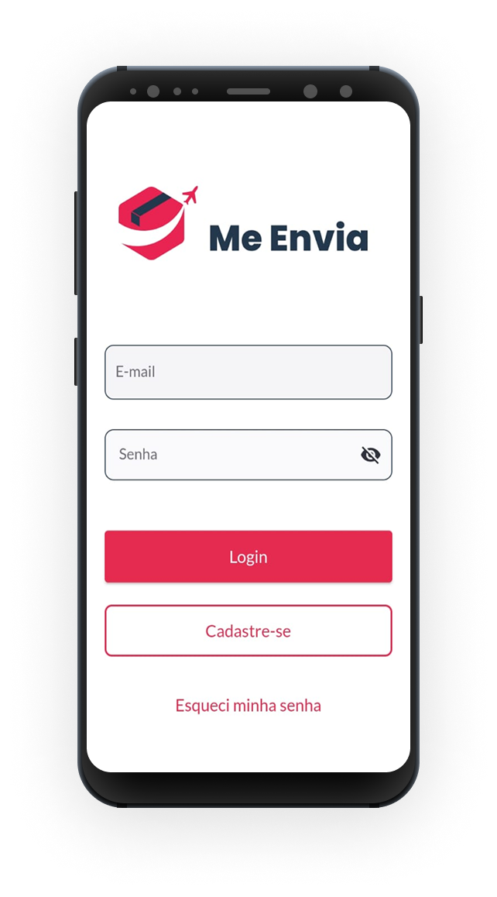
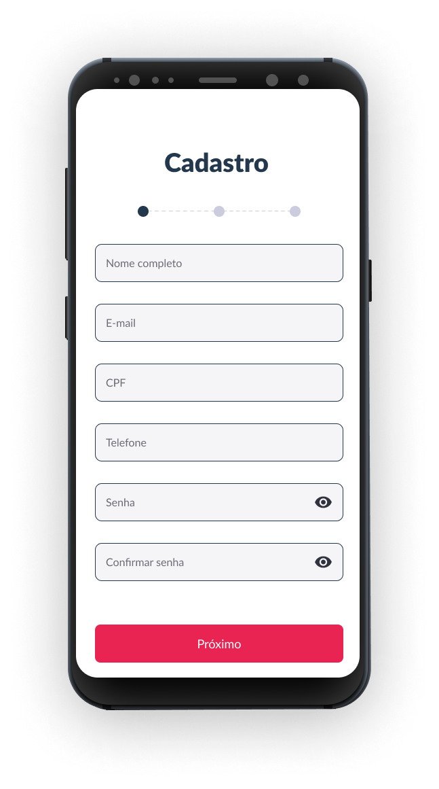
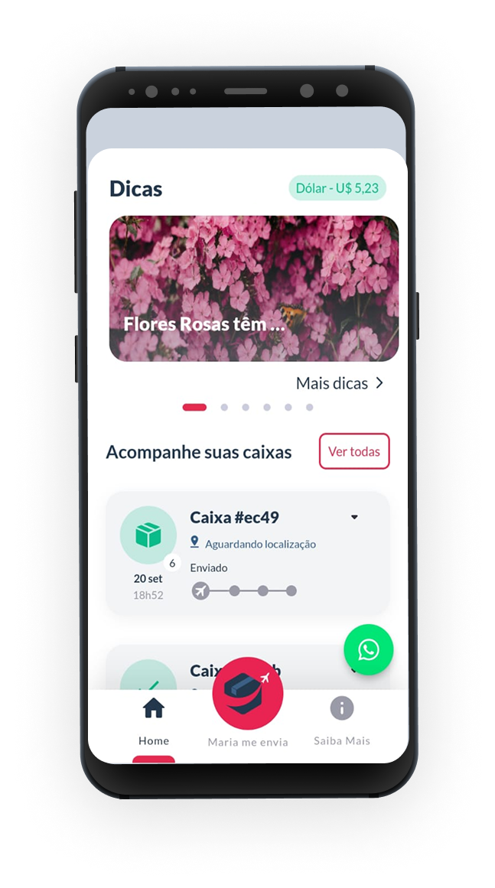
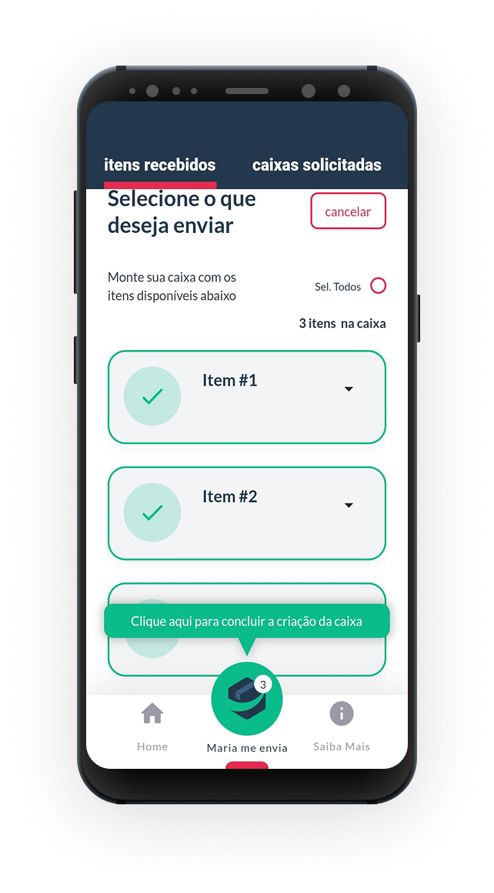
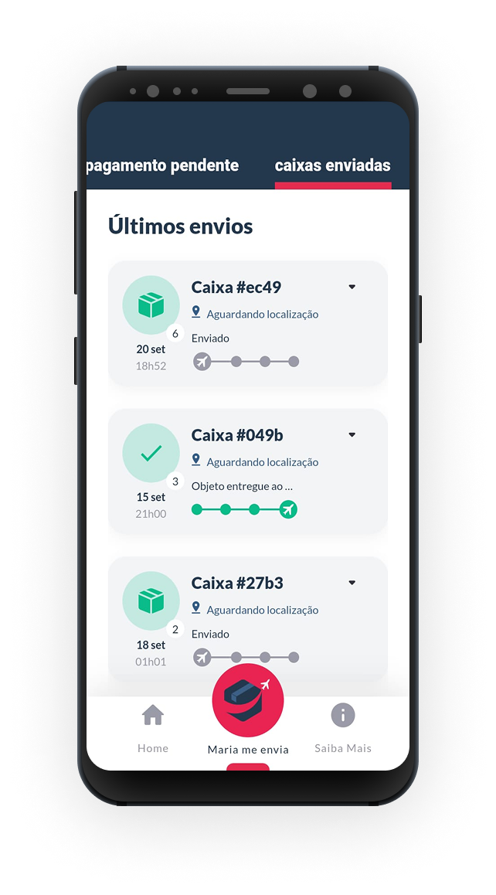
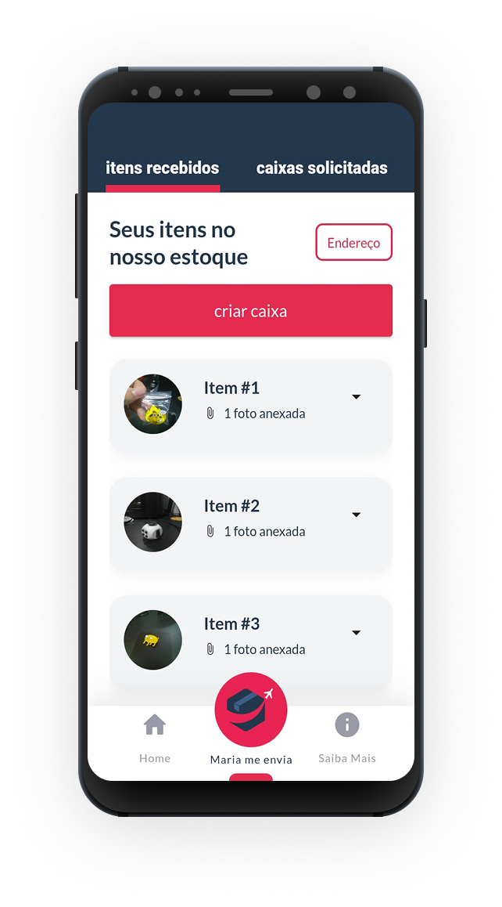

<p align="center">
  <br>
   
   
   
   
   
   
</p>

---

#### Este é um projeto desenvolvido em **Flutter** que tem como objetivo concluir residencia de software. A aplicação foi projetada para fornecer uma estrutura modular e de fácil manutenção, com foco em boas práticas de desenvolvimento.

---

## 📖 Sobre o Projeto

A aplicação apresenta uma tela de login, cadastro e funcionalidades relacionadas à gestão de controle de envio de pacotes. A arquitetura do projeto foi planejada para ser escalável e bem organizada, com foco nas seguintes divisões principais:

- **Core**: Contém módulos reutilizáveis, como gerenciamento de erros, helpers e comunicação com a API.
- **Features**: Contém funcionalidades específicas do aplicativo, como telas e lógica relacionadas.

---

## Getting Started

### 1. Clone the repository

```
git clone git@github.com:brandaoti/me-envia.git
```

### 2. Update the file name

Change the file name `flutter` to your project's name: `my-project-flutter`

### 3. Update the git remote URL and push it to your project's repository
```
cd [your project flutter]
git remote set-url origin git@github.com:my-project/my-project-flutter.git
git push

* Commit changes
```
git add .
git commit -m "Update package name"
git push
```